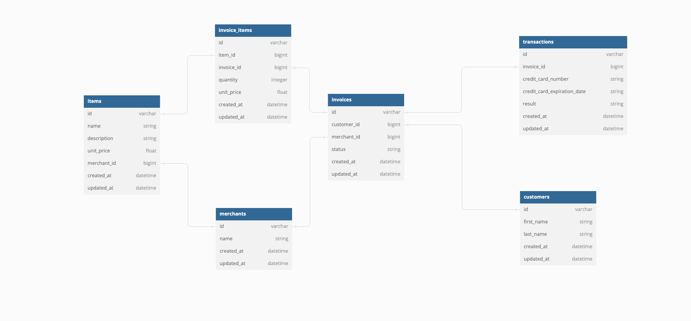

# README
# Rails Engine
---
 

## Rails Engine Project Description

#### 
Rails Engine is a web API utilizing the database relationships from [Little Esty Shop](https://github.com/aj-bailey/little_esty_shop_bulk_discounts)'s project with the exception that the Merchant's table is now linked to the Invoice table in addition to Item table.  The API allows for CRUD functionality between the items and merchant table, as well as some additional destroy functionality for the Invoice table.

#### 
In addition to the RESTful CRUD API functionality above, non-RESTful routes for <i>Find</i> and <i>Find_All</i> endpoints allows for search functionality between the two tables.  Pagination was also incorporated into the Merchant's index route.

#### <i><u>Database Tables</u></i>

---
 

## Installation
 

#### To install, please clone the following repository to your local machine:
[Rails Engine](https://github.com/aj-bailey/rails-engine)

---
 

## Executing
 

#### The following are steps for executing Rails Engine:
1. Open your terminal
2. Navigate to root directory of the program
3. Run `bundle install`
4. Run `rails db:{drop,create,migrate,seed}`
5. Run `rails server`
6. Open your web browser of choice
7. Enter `http://localhost:3000/` into your address bar
8. Enter desired endpoint from list below
9. When finished, press `Ctrl+C` in your terminal to close server
 
 

---
 

## API Endpoints
### Merchants
- Get All Merchants <b> GET /api/v1/merchants </b>
- Get One Merchants <b> GET /api/v1/merchants/:id </b>
- Get a Merchant's Items <b> GET /api/v1/merchants/:id/items </b>
- Find Merchant by Name <b> GET api/v1/merchants/find?name=

### Items
- Get All Items <b> GET /api/v1/items </b>
- Get One Item <b> GET /api/v1/items/:id</b>
- Get All Items <b> GET /api/v1/items </b>
- Create an Item <b> POST /api/v1/items
- Destroy an Item <b> DELETE /api/v1/items/:id
- Update an Item <b> PATCH /api/v1/items/:id
- Get an Item's Merchant <b> GET /api/v1/items/:id/merchant
- Find Item by Name <b> GET api/v1/items/find_all?name=
- Find Item by Min Price <b> GET api/v1/items/find_all?min_price=
- Find Item by Max Price <b> GET api/v1/items/find_all?max_price=
- Find Item Between Min and Max Price <b> GET api/v1/items/find_all?min_price=&max_price=

---
 

## Future Goals
- Add pagination for Items index API endpoint
- Add Find_all functionality for Merchants
- Add find functionality for Items
---
 

## Contributors
Adam Bailey <ab67319@gmail.com>; [@github.com/aj-bailey](@github.com/aj-bailey>)